# ✨Meme Keywords

**🎈总表情数：56**

| # | 预览 | 关键词 | 图片 | 文字 | 默认文字 | 模块 | 创建日期 |
|:--:|:----:|:------:|:---------:|:------:|:------:|:----------:|:----:|
| 1 | 
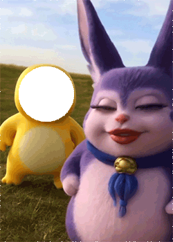
 | 打招呼 | 1 | 1 | 小奶龙 | [sayhi](../memes/sayhi) | 2025-06-25 |
| 2 | 
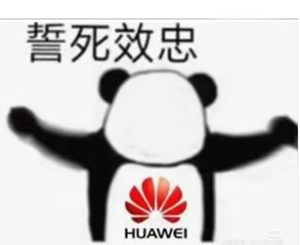
 | 忠诚 | 1 | 0 | 华为 | [zhogncheng](../memes/zhogncheng) | 2025-06-23 |
| 3 | 

 | 列队 | 1 | &nbsp; | &nbsp; | [liedui](../memes/liedui) | 2025-06-19 |
| 4 | 

 | 唑一唑 | 1 | &nbsp; | &nbsp; | [zuoyizuo](../memes/zuoyizuo) | 2025-06-17 |
| 5 | 
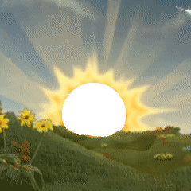
 | 日出 | 1 | &nbsp; | &nbsp; | [richu](../memes/richu) | 2025-06-17 |
| 6 | 

 | 你再说 你闭嘴 | 1 | 0 | 你闭嘴！ | [nizaishuo](../memes/nizaishuo) | 2025-06-16 |
| 7 | 
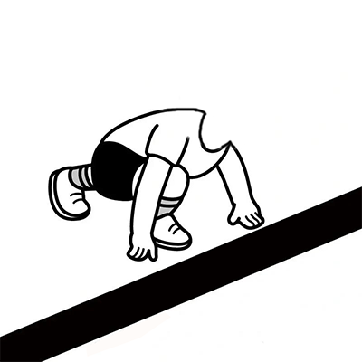
 | 下班 | 1 | 0 | &nbsp; | [downban](../memes/downban) | 2025-06-13 |
| 8 | 
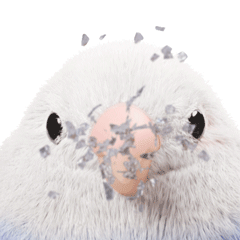
 | 嘴你 | 1 | &nbsp; | &nbsp; | [zuini](../memes/zuini) | 2025-06-11 |
| 9 | 

 | 群友举牌 他举牌 你举牌 | 1 | 1 | 我是晓楠嬢 | [qunyoujupai](../memes/qunyoujupai) | 2025-06-10 |
| 10 | 

 | doro锤 | 2 | &nbsp; | &nbsp; | [dorochui](../memes/dorochui) | 2025-06-09 |
| 11 | 
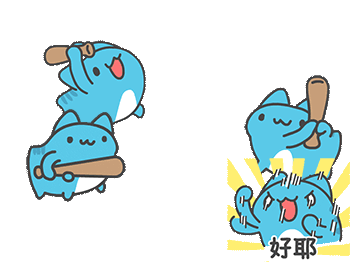
 | 咖波群殴 | 1 | &nbsp; | &nbsp; | [capoo_qunou](../memes/capoo_qunou) | 2025-06-06 |
| 12 | 

 | 咖波爱心 ❤️ | 1 | &nbsp; | &nbsp; | [capoo_love](../memes/capoo_love) | 2025-06-06 |
| 13 | 

 | doro抽 | 1 | &nbsp; | &nbsp; | [dorochou](../memes/dorochou) | 2025-06-02 |
| 14 | 
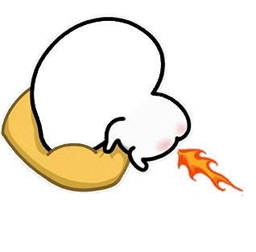
 | 喷射 | 1 | &nbsp; | &nbsp; | [penshe](../memes/penshe) | 2025-05-31 |
| 15 | 
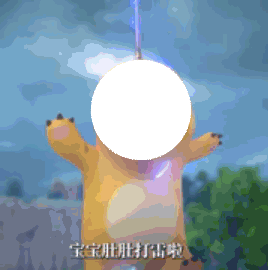
 | 劈奶龙 | 1 | &nbsp; | &nbsp; | [pinailong](../memes/pinailong) | 2025-05-31 |
| 16 | 
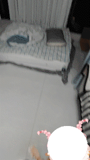
 | 丢猫 | 1 | &nbsp; | &nbsp; | [diucat](../memes/diucat) | 2025-05-30 |
| 17 | 

 | 痞老板 | 1 | &nbsp; | &nbsp; | [piboss](../memes/piboss) | 2025-05-30 |
| 18 | 
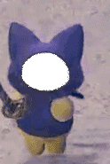
 | 追杀喵 | 1 | &nbsp; | &nbsp; | [zhuishamiao](../memes/zhuishamiao) | 2025-05-28 |
| 19 | 
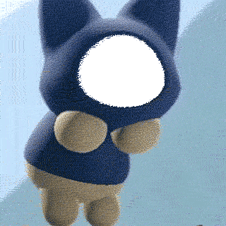
 | 敬礼喵 | 1 | &nbsp; | &nbsp; | [yesirmiao](../memes/yesirmiao) | 2025-05-28 |
| 20 | 

 | doro踢 | 1 | &nbsp; | &nbsp; | [doroti](../memes/doroti) | 2025-05-27 |
| 21 | 

 | 斯派克抱摔 | 1 | &nbsp; | &nbsp; | [spike_spinebuster](../memes/spike_spinebuster) | 2025-05-27 |
| 22 | 

 | 咖波打 | 1 | &nbsp; | &nbsp; | [capooplay](../memes/capooplay) | 2025-05-27 |
| 23 | 
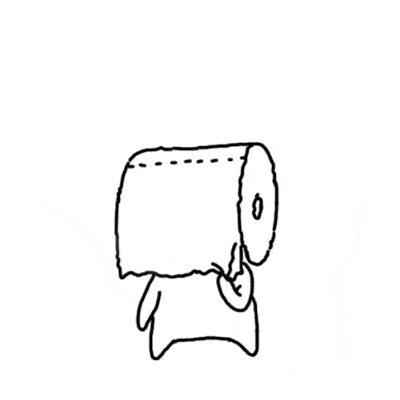
 | 不要脸 撕脸 | 1 | 1 | 我就是不要脸  你来撕我啊 | [buyaolian](../memes/buyaolian) | 2025-05-24 |
| 24 | 

 | 猪猪车 | 2 | &nbsp; | &nbsp; | [pigcar](../memes/pigcar) | 2025-05-23 |
| 25 | 

 | 吉伊卡哇 | 2 | &nbsp; | &nbsp; | [chiikawa](../memes/chiikawa) | 2025-05-22 |
| 26 | 

 | 芙莉莲v50 | 1 | 0 | &nbsp; | [fulilian_v50](../memes/fulilian_v50) | 2025-05-22 |
| 27 | 

 | 丅亠 | 1 | 1 | 这个群友，蒸丅亠！ | [xiatou](../memes/xiatou) | 2025-05-22 |
| 28 | 

 | 洗了 | 1 | 1 | 救我，我要洗了 | [xile](../memes/xile) | 2025-05-21 |
| 29 | 

 | 无影腿 | 1 | &nbsp; | &nbsp; | [wuyingtui](../memes/wuyingtui) | 2025-05-21 |
| 30 | 

 | 电死你 | 1 | 1 | 猪头 | [electrify_you](../memes/electrify_you) | 2025-05-20 |
| 31 | 

 | 炒你 | 1 | &nbsp; | &nbsp; | [caosini](../memes/caosini) | 2025-05-20 |
| 32 | 

 | 喷水 | 1 | 1 | 龙王 | [penshui](../memes/penshui) | 2025-05-20 |
| 33 | 

 | doro鸭 | 1 | &nbsp; | &nbsp; | [doroya](../memes/doroya) | 2025-05-19 |
| 34 | 

 | 咖波照 | 1 | 1 | 美死了 | [capoozhao](../memes/capoozhao) | 2025-05-19 |
| 35 | 

 | doro拖地 | 1 | &nbsp; | &nbsp; | [dorotuodi](../memes/dorotuodi) | 2025-05-19 |
| 36 | 

 | 可莉打 | 1 | &nbsp; | &nbsp; | [keliplay](../memes/keliplay) | 2025-05-19 |
| 37 | 

 | 工贼 | 1 | 1 | 我爱加班 | [gongzei](../memes/gongzei) | 2025-05-17 |
| 38 | 

 | 打分 | 1 | 1 | 满分 | [dafen](../memes/dafen) | 2025-05-17 |
| 39 | 

 | 我敲 | 1 | 1 | 笨死了 | [myplay](../memes/myplay) | 2025-05-17 |
| 40 | 

 | 给你一拳 | 1 | &nbsp; | &nbsp; | [onepunch](../memes/onepunch) | 2025-05-16 |
| 41 | 

 | 创飞 | 1 | &nbsp; | &nbsp; | [chuangfei](../memes/chuangfei) | 2025-05-15 |
| 42 | 

 | 打棒球 | 1 | &nbsp; | &nbsp; | [play_baseball](../memes/play_baseball) | 2025-05-15 |
| 43 | 

 | yoyo | 1 | &nbsp; | &nbsp; | [yo_yo](../memes/yo_yo) | 2025-05-15 |
| 44 | 

 | 太阳花 | 1 | &nbsp; | &nbsp; | [sunflower](../memes/sunflower) | 2025-05-14 |
| 45 | 

 | 小狗 | 1 | &nbsp; | &nbsp; | [mix_dog](../memes/mix_dog) | 2025-05-14 |
| 46 | 

 | 我的证 | 1 | 0 | 牛马 | [my_certificate](../memes/my_certificate) | 2025-05-14 |
| 47 | 

 | 太极 | 1 | &nbsp; | &nbsp; | [shadow_boxing](../memes/shadow_boxing) | 2025-05-14 |
| 48 | 

 | 起床 | 1 | &nbsp; | &nbsp; | [get_up](../memes/get_up) | 2025-05-14 |
| 49 | 

 | sm | 1 | &nbsp; | &nbsp; | [sm](../memes/sm) | 2025-05-13 |
| 50 | 

 | 拖鞋 | 1 | &nbsp; | &nbsp; | [slipper](../memes/slipper) | 2025-05-13 |
| 51 | 

 | 陀螺 | 1 | &nbsp; | &nbsp; | [spinner](../memes/spinner) | 2025-05-13 |
| 52 | 

 | 警车 | 1 | &nbsp; | &nbsp; | [police_car](../memes/police_car) | 2025-05-13 |
| 53 | 

 | 互动 | 2 | &nbsp; | &nbsp; | [interaction](../memes/interaction) | 2025-05-12 |
| 54 | 

 | 龟龟撅 | 2 | &nbsp; | &nbsp; | [turtle_jue](../memes/turtle_jue) | 2025-05-12 |
| 55 | 

 | 菠萝 pineapple | 1 | &nbsp; | &nbsp; | [pineapple](../memes/pineapple) | 2024-11-10 |
| 56 | 
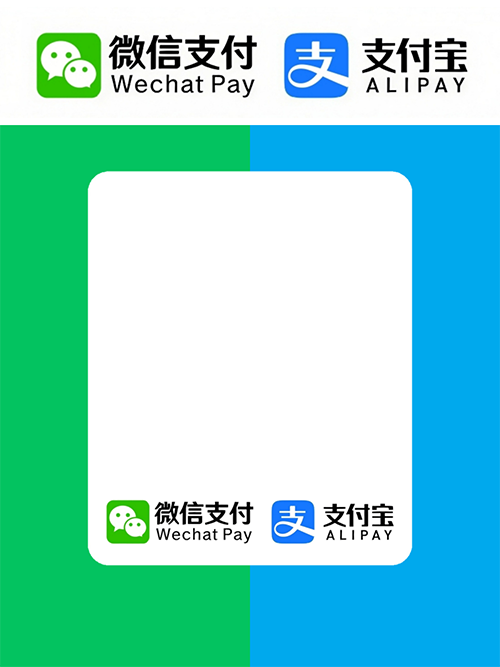
 | 收款码 付款码 | 1 | 0 | &nbsp; | [payment_code](../memes/payment_code) | 2024-05-12 |