# ✨Meme Keywords

**🎈总表情数：31**

| 模块 | 关键词 | 预览 |
|------|--------|------|
| [caosini](../memes/caosini) | 炒你 |  |
| [capoozhao](../memes/capoozhao) | 咖波照 |  |
| [chiikawa](../memes/chiikawa) | 吉伊卡哇 | 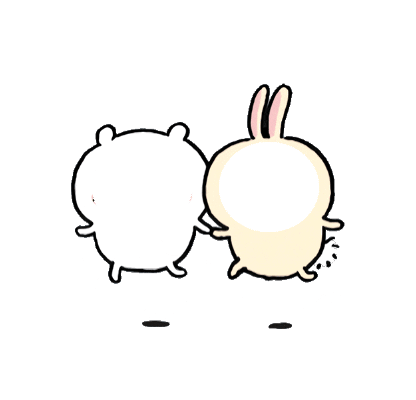 |
| [chuangfei](../memes/chuangfei) | 创飞 |  |
| [dafen](../memes/dafen) | 打分 | 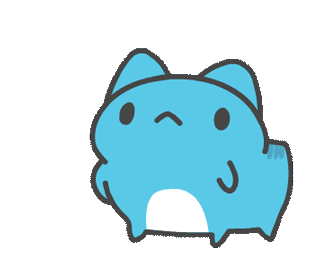 |
| [dorotuodi](../memes/dorotuodi) | doro拖地 |  |
| [doroya](../memes/doroya) | doro鸭 |  |
| [electrify_you](../memes/electrify_you) | 电死你 |  |
| [get_up](../memes/get_up) | 起床 | 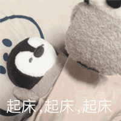 |
| [gongzei](../memes/gongzei) | 工贼 | 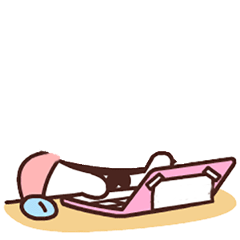 |
| [interaction](../memes/interaction) | 互动 |  |
| [keliplay](../memes/keliplay) | 可莉打 | 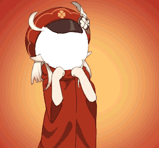 |
| [mix_dog](../memes/mix_dog) | 小狗 |  |
| [my_certificate](../memes/my_certificate) | 我的证 |  |
| [myplay](../memes/myplay) | 我打 |  |
| [onepunch](../memes/onepunch) | 给你一拳 | 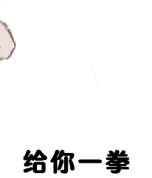 |
| [penshui](../memes/penshui) | 喷水 |  |
| [pineapple](../memes/pineapple) | 菠萝, pineapple |  |
| [play_baseball](../memes/play_baseball) | 打棒球 |  |
| [police_car](../memes/police_car) | 警车 | 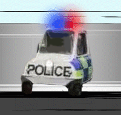 |
| [shadow_boxing](../memes/shadow_boxing) | 太极 | 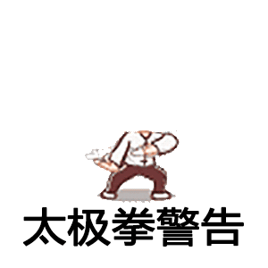 |
| [slipper](../memes/slipper) | 拖鞋 |  |
| [sm](../memes/sm) | sm | 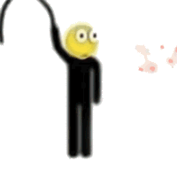 |
| [spinner](../memes/spinner) | 陀螺 |  |
| [sunflower](../memes/sunflower) | 太阳花 | 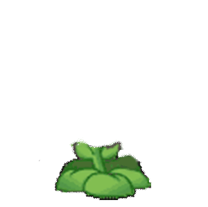 |
| [turtle_jue](../memes/turtle_jue) | 龟龟撅 | 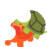 |
| [wuyingtui](../memes/wuyingtui) | 无影腿 |  |
| [xiatou](../memes/xiatou) | 丅亠 |  |
| [xile](../memes/xile) | 洗了 | 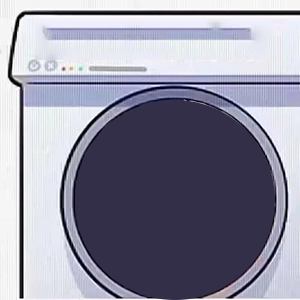 |
| [yo_yo](../memes/yo_yo) | yoyo |  |